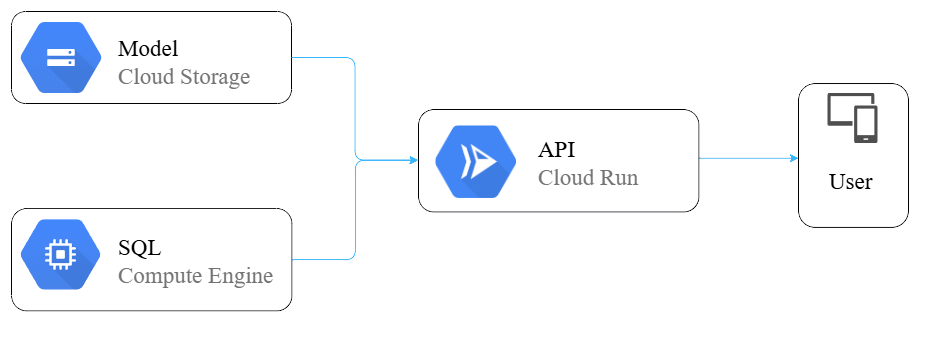

# Glusity (Cloud Computing)

This capstone project will develop a diabetes management web app on Google Cloud Platform. The backend, built with Node.js, will handle core functionality, including authentication and authorization, while the frontend will use a JavaScript framework. Predictive blood sugar trend modeling will be implemented using TensorFlow.js. Development will be conducted in Visual Studio Code, with Postman for API testing and GitHub for version control. The project will include full API documentation and backup options for reliable demonstrations.

## **CC Path :**

| Name                 | Student ID   | Universitas      |
| -------------------- | ------------ | ---------------- |
| Rayhan Al Farassy    | C308B4KY3710 | Universitas Riau |
| Reza Ramadhani Putra | C308B4KY3789 | Universitas Riau |

## **Requirements & Tools :**

## **Cloud Architecture:**

## **Endpoints :**

- /login POST: Log in a user with credentials.
- /register POST: Register a new user account.
- /logout POST: Log out the current user.
- /update PUT: Update user information.
- /profile GET: Retrieve the authenticated user's profile.
- /check POST: Server health check or validation.
- /:id GET: Retrieve resource by ID.
- /news GET: Fetch latest news or updates.

## **Service in GCP :**

- Cloud Run
- Cloud Storage
- Compute Engine

 

## Week 1 Progress

- Build cloud architecture for capstone project,
- Setup storage service for machine learning model,
- Setup database service for prediction data,
- Completing and submit Project Plan.

## Week 2 Progress

- Building API with requirement from Mobile
- Setup Github and project to monitor every task
- Calculate Pricing cost for all the services

