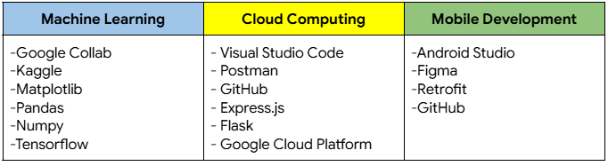

# Glusity: Smart Solutions for Diabetes & Obesity 
This project is aimed at developing an application that predicts blood sugar levels using obesity data inputted by users. It enables the creation of healthier lifestyle choices, especially for Indonesians, by tracking calorie intake and sugar consumption, as well as providing future health insights.

## 🆔 Team ID: C242-PS006  
### **Team Members:**  
| Name 👤                     | Bangkit-ID 🎓 | Path 🌐           | University 🏫            |
| --------------------------- | ------------- | ----------------- | ------------------------ |
| Fadhlur Rohman              | M443B4KY1326  | Machine Learning  | Universitas Islam Riau   |
| M. Bhayaziid Amalin         | M443B4KY2334  | Machine Learning  | Universitas Islam Riau   |
| Muhammad Dani Nasution      | M443B4KY2775  | Machine Learning  | Universitas Islam Riau   |
| Fatimah Azzahra             | A308B4KX1442  | Mobile Development| Universitas Riau         |
| Salwa Destrin Karina        | A308B4KX4049  | Mobile Development| Universitas Riau         |
| Rayhan Al Farassy           | C308B4KY3710  | Cloud Computing   | Universitas Riau         |
| Reza Ramadhani Putra        | C308B4KY3789  | Cloud Computing   | Universitas Riau         |

## ✨ Features  
- Prediction Application: Supports login and stores user prediction history for tracking progress.  
- Integrated Health Insights: Blood sugar checks and obesity calculations for holistic health analysis.  
- User-Friendly Interface: Includes settings and detailed health statistics for better tracking and monitoring.

## 📋 Project Scope  
### **📱 Mobile App Development:**  
- Glucose Monitoring & Prediction: User input-based diabetes and obesity prediction.  
- User Account Management: Secure login system with user profile management and data storage.  

### **☁️ Cloud Computing Infrastructure:**  
- Scalable Environment: High availability with robust cloud architecture.  
- Server-Side Components: APIs for account management and data handling.  

### **🤖 Machine Learning Integration:**  
- Predictive Model: Diabetes and obesity estimation based on user input.  
- Transfer Learning: Enhanced prediction accuracy using pre-trained models.  
- ML Frameworks: TensorFlow, Pandas, and related libraries.  

## 🛠️ Tools/IDE/Library  
  

## 📦 Installation  
- Download the mobile APK from the provided link (to be shared).  

## 📂 Dataset Links  
- [Diabetes Prediction Dataset](https://www.kaggle.com/datasets/iammustafatz/diabetes-prediction-dataset)  
- [Obesity Levels Dataset](https://www.kaggle.com/datasets/fatemehmehrparvar/obesity-levels)  

## 📄 API Reference  
Postman Documentation: [Glusity API Reference](https://documenter.getpostman.com/view/39192802/2sAYBUED2L)  
