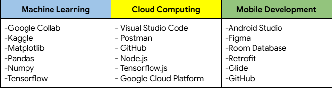

<<<<<<< HEAD

# Glusity: Smart Solutions for Diabetes & Obesity 
This project is aimed at developing an application that predicts blood sugar levels by using obesity data inputted by users. It enables the creation of healthier life-style choices, especially Indonesians, through tracking calorie intake and sugar consumption, as well as providing future health insights.

## 🆔 Team ID: C242-PS006 
**Team Member :**
| Name 👤                        | Bangkit-ID 🎓 | Path 🌐           | University 🏫                                        |
| -------------                   | ------------- | -------------      | -------------                                        |
| Fadhlur Rohman                  | M443B4KY1326  | Machine Learning   | Universitas Islam Riau                               |
| M. Bhayaziid Amalin             | M443B4KY2334  | Machine Learning   | Universitas Islam Riau                               |
| Muhammad Dani Nasution          | M443B4KY2775  | Machine Learning   | Universitas Islam Riau                               |
| Fatimah Azzahra                 | A308B4KX1442  | Mobile Development | Universitas Riau                                     |
| Salwa Destrin Karina            | A308B4KX4049  | Mobile Development | Universitas Riau                                     |
| Rayhan Al Farassy               | C308B4KY3710  | Cloud Computing    | Universitas Riau                                     |
| Reza Ramadhani Putra            | C308B4KY3789  | Cloud Computing    | Universitas Riau                                     |


## ✨ Features  
- Prediction application with authentication login and data storage to facilitate user access and tracking of prediction history.
- Blood sugar check integrated with obesity calculation to provide a comprehensive overview of the user's health.
- Latest health-related news to enhance user knowledge and keep them informed about healthy lifestyles and medical developments.
- User settings and detailed display of blood sugar check statistics to help monitor changes and health trends.

## 📋 Project Scope 
**📱 Mobile App Development:** 
- Glucose Monitoring & Prediction: User input-based diabetes and obesity prediction.
- User Account Management: Secure login system, user profile management, and data storage.
- Health Insights & News: Daily updates on health-related topics and articles.

**☁️ Cloud Computing Infrastructure:** 
- Scalable and Reliable Environment: Robust cloud architecture for high availability.
- Server-side Components: API development for account management and data handling.
- Data Storage & Management: Integration with cloud database and object storage services.

**🤖 Machine Learning Integration:** 
- Predictive Model: Machine learning model for diabetes and obesity estimation using user inputs.
- Transfer Learning Approach: Utilizing pre-trained models to enhance prediction accuracy.
- ML Frameworks: Implementation using TensorFlow, Pandas, and related libraries.

**🛠️ Tools/IDE/Library:** 


=======
# Glusity (Machine Learning)

This capstone project integrates two machine learning models to predict obesity and blood sugar levels. An obesity model, trained in TensorFlow using a Kaggle dataset, feeds its output into a diabetes prediction model, improving prediction accuracy and providing insights into both obesity and diabetes risk.

<<<<<<< HEAD
##
Nama : M. Bhayaziid Amalin
## Fitur
=======
## **ML Path :**
| Name                              | Student ID  | Universitas   |
| ----------------------------------|-------------|---------------|
| Fadhlur Rohman                    | M443B4KY1326| Universitas Islam Riau |
| M. Bhayaziid Amalin	              | M443B4KY2334| Universitas Islam Riau |
| Muhammad Dani Nasution            | M443B4KY2775| Universitas Islam Riau |
>>>>>>> 195b3f92a2501907e6de700de1e254b280a0e841

## Requirements & Tools


## Dataset

### Link to dataset

<<<<<<< HEAD
1. Clone repositori ini:
   ```bash
   git clone https://github.com/mdaninas/Capstone-Project.git
. TES 1 2 3
=======
## Preprocessing Data

## Create Models


## Week 1 Progress

- Use international data from Kaggle in csv format,  
- Gathering data with Pandas Library,
- Cleaning data and explore the data,
- Plotting the data,
- Completing and submit Project Plan.
>>>>>>> 195b3f92a2501907e6de700de1e254b280a0e841
>>>>>>> 4920ce67741b6685fa9034f9ee3888b04b469e33
